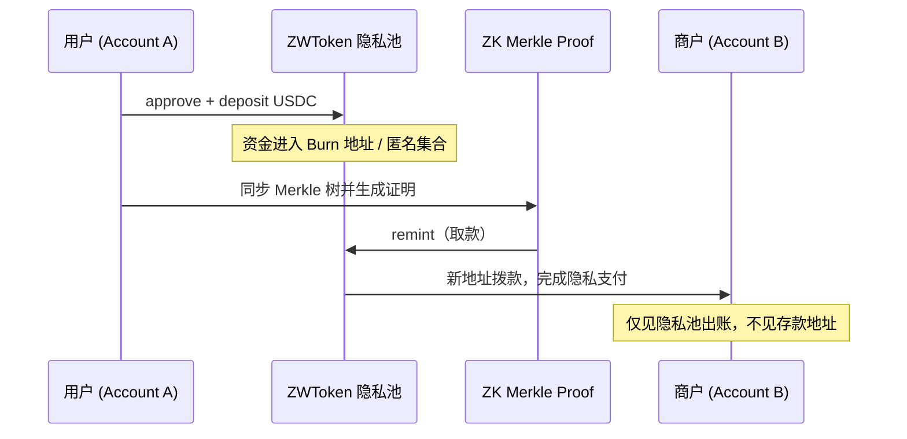

# Aegis · ZKBuy

**结合零知识证明与 AI 助手的隐私支付 Demo** —— 让用户在真实支付场景中，不必一直暴露主钱包地址。

基于 [imToken WASM 模块](https://github.com/consenlabs/token-core-monorepo/) 构建，在 Sepolia 测试网上完成真实的链上 ZK 存取款与模拟商户支付（如「麦当劳巨无霸套餐」）。

---

## 为什么需要 ZKBuy？

用钱包做日常支付时，用户往往不希望**始终用同一个链上地址**向商户付款。同一地址会暴露消费历史，零售商可以关联你过去的交易。

ZKBuy 的出发点是：

- 从主地址派生**一次性 / 匿名收款地址**，切断「存款地址」与「支付给商户的地址」之间的链上关联；
- 商户（如麦当劳）在收款时，只能看到资金来自**隐私池合约**，无法追溯到用户最初存入 USDC 的地址；
- 存、取之间的**时间间隔**可提升隐私强度，但手动管理多笔存款的 secret 又很繁琐 —— 因此引入 **AI 模式**，用自然语言完成存钱、查余额、延迟取钱支付。

底层隐私代币能力基于团队提出的 **[EIP-8065](https://eips.ethereum.org/EIPS/eip-8065)**（ZWToken / JWToken 思路）；本仓库侧重 Demo 集成与产品体验，不展开协议细节。

---

## 核心流程



| 阶段 | 说明 |
|------|------|
| **派生账户** | 输入密钥短语 → 哈希 → `create_keystore` / `derive_accounts` 得到 Account A（付款）与 Account B（匿名收款） |
| **存入隐私池** | 将 USDC 存入 ZWToken 合约（`deposit`），资金进入隐私集合 |
| **生成证明** | 同步匿名 Merkle 树，本地生成 ZK Merkle Proof（约 30–60 秒） |
| **取款支付** | `remint` 从合约向新地址拨款，完成向商户的隐私支付 |

---

## 功能概览

### 手动模式（Dashboard）

- 输入密钥短语初始化 WASM 钱包
- **隐私支付**：一键串联 approve → deposit → 同步树 → 证明 → remint
- 控制台展示各步链上交易哈希（Sepolia Etherscan 可验证）
- 右上角展示 ETH / USDC 余额

### AI 模式

通过对话驱动内置 Agent Tools，再调用 imToken WASM 完成签名与发交易：

| 意图 | 行为 |
|------|------|
| 存钱 | 将固定金额（Demo 为 10 USDC）存入隐私池；支持 USDC `permit` 等路径 |
| 查看隐私余额 | 查询隐私池中待取款存款 |
| 取钱 / 支付 | 基于本地 secret 生成 proof 并 `remint` 到匿名地址 |
| 全流程支付 | 存 + 取连续执行（**无时间间隔时隐私较弱**，适合演示） |

推荐用法：先存钱，隔一段时间再让 AI 取钱支付，在隐私与易用性之间取得平衡，而无需用户自己记住每笔存款的 secret。

---

## 技术栈

| 层级 | 技术 |
|------|------|
| 前端 | Next.js 16、React 19、Tailwind CSS 4 |
| 链交互 | ethers v6、Sepolia 测试网 |
| 钱包 / 签名 | imToken `tcx_wasm`（`create_keystore`、`derive_accounts`、交易签名） |
| 零知识 | snarkjs、circomlibjs；Merkle 树同步与 Groth16 证明生成 |
| 合约 | ZWERC20（隐私池）、Circle Sepolia USDC |
| AI | OpenAI 兼容 API + 结构化 `[ACTION:…]` 驱动链上 Tool |

---

## 快速开始

### 环境要求

- Node.js 18+
- 浏览器支持 WebAssembly

### 安装与运行

```bash
git clone <repo-url>
cd Aegis
npm install
npm run dev
```

浏览器打开 [http://localhost:3000](http://localhost:3000)。

### 使用步骤

1. **初始化**：输入任意密钥短语（本地推导，勿用于主网资产）。
2. **准备测试资产**：向 Account A 充值 Sepolia ETH（gas）与 USDC。
3. **隐私支付**或进入 **AI 模式**，按界面 / 对话提示完成存取款。

### AI 模式配置

在 `src/app/AIModeScreen.tsx` 中配置 OpenAI 兼容接口：

```ts
const LLM_BASE_URL = "https://your-api/v1";
const LLM_API_KEY  = "sk-...";
const LLM_MODEL    = "gpt-4o";
```

### 部署同步（可选）

```bash
./sync.sh
```

通过 `rsync` 将代码同步到远程服务器；可在环境变量中设置 `REMOTE_HOST`、`REMOTE_DIR` 等。

---

## 项目结构

```
src/
├── app/
│   ├── ZKBuyApp.tsx      # 主界面：设置、Dashboard、手动隐私支付流
│   ├── AIModeScreen.tsx  # AI 对话与 Agent 链上操作
│   └── api/rpc/          # Sepolia RPC 代理（规避浏览器 CORS）
├── lib/
│   ├── wasm.ts           # imToken WASM 初始化与封装
│   ├── wallet.ts         # 密钥短语 → keystore → 双账户派生
│   ├── signer.ts         # approve / deposit / proof / remint 流程
│   ├── zkProof.ts        # Merkle 树与 ZK 证明
│   └── contracts.ts      # Sepolia 合约地址与 ABI
└── pkg/                  # tcx_wasm 预编译包
```

---

## 合约地址（Sepolia）

| 名称 | 地址 |
|------|------|
| ZWERC20（隐私池） | `0x7E45741E01F5830Ff69a9faB1B6bd3f953da0503` |
| USDC | `0x1c7D4B196Cb0C7B01d743Fbc6116a902379C7238` |
| ZWETH | `0x48E4C0f0BE2a996b36F72dED5A21C170a2404796` |

区块浏览器：[Sepolia Etherscan](https://sepolia.etherscan.io)

---

## 隐私说明

- 本仓库为 **Hackathon / Demo**，仅用于 Sepolia 测试网，请勿在主网存放真实资产。
- 隐私强度取决于池内匿名集规模、存取时间间隔、以及是否使用第三方广播地址等；Demo 中部分交易仍由本地 WASM 签名广播。
- AI 模式会将操作意图发送至配置的 LLM 服务，请自行评估 API 提供商的可信度。

---

## 相关资源

- [EIP-8065: ZWToken](https://eips.ethereum.org/EIPS/eip-8065)
- [imToken token-core-x (WASM)](https://github.com/consenlabs/token-core-x)

---
